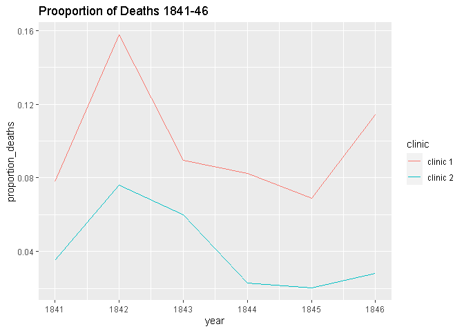
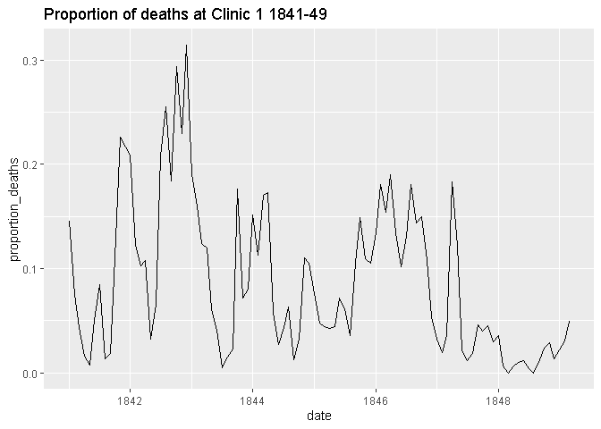
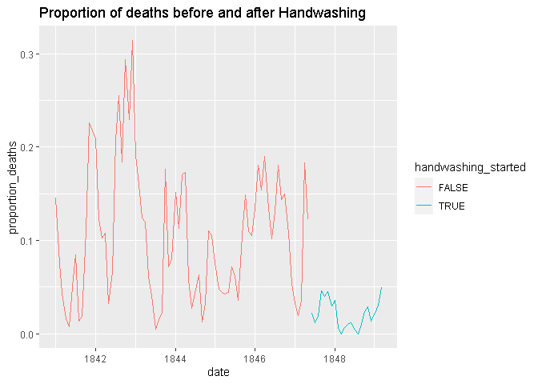

Dr. Seimmelweis and the discovery of Handwashing
================
Mark Mukasa

## Project Description

In 1847, the Hungarian physician Ignaz Semmelweis made a breakthough
discovery: he discovers handwashing. Contaminated hands was a major
cause of childbed fever and by enforcing handwashing at his hospital he
saved hundreds of lives. This project intends to explore and analyse the
data behind one of the most important discoveries of modern medicine:
handwashing.


## Data Exploration

We’ll load the required package: **tidyverse**

``` r
library(tidyverse)
```

    ## -- Attaching packages --------------------------------------- tidyverse 1.3.1 --

    ## v ggplot2 3.3.5     v purrr   0.3.4
    ## v tibble  3.1.6     v dplyr   1.0.7
    ## v tidyr   1.1.4     v stringr 1.4.0
    ## v readr   2.1.1     v forcats 0.5.1

    ## -- Conflicts ------------------------------------------ tidyverse_conflicts() --
    ## x dplyr::filter() masks stats::filter()
    ## x dplyr::lag()    masks stats::lag()

## Importing datasets

``` r
setwd("~/project_2/Dr. Semmelweis and the Discovery of Handwashing/datasets")
yearly <- read_csv("yearly_deaths_by_clinic.csv")
```

    ## Rows: 12 Columns: 4

    ## -- Column specification --------------------------------------------------------
    ## Delimiter: ","
    ## chr (1): clinic
    ## dbl (3): year, births, deaths

    ## 
    ## i Use `spec()` to retrieve the full column specification for this data.
    ## i Specify the column types or set `show_col_types = FALSE` to quiet this message.

``` r
monthly <- read_csv("monthly_deaths.csv")
```

    ## Rows: 98 Columns: 3

    ## -- Column specification --------------------------------------------------------
    ## Delimiter: ","
    ## dbl  (2): births, deaths
    ## date (1): date

    ## 
    ## i Use `spec()` to retrieve the full column specification for this data.
    ## i Specify the column types or set `show_col_types = FALSE` to quiet this message.

We’ll now expore the datasets to understand the different variables and
observations. Starting with the yearly;

``` r
glimpse(yearly)
```

    ## Rows: 12
    ## Columns: 4
    ## $ year   <dbl> 1841, 1842, 1843, 1844, 1845, 1846, 1841, 1842, 1843, 1844, 184~
    ## $ births <dbl> 3036, 3287, 3060, 3157, 3492, 4010, 2442, 2659, 2739, 2956, 324~
    ## $ deaths <dbl> 237, 518, 274, 260, 241, 459, 86, 202, 164, 68, 66, 105
    ## $ clinic <chr> "clinic 1", "clinic 1", "clinic 1", "clinic 1", "clinic 1", "cl~

From the above, the yearly variable is composed of 4 columns(year,
births, deaths, clinic) and 12 rows.

``` r
head(yearly)
```

    ## # A tibble: 6 x 4
    ##    year births deaths clinic  
    ##   <dbl>  <dbl>  <dbl> <chr>   
    ## 1  1841   3036    237 clinic 1
    ## 2  1842   3287    518 clinic 1
    ## 3  1843   3060    274 clinic 1
    ## 4  1844   3157    260 clinic 1
    ## 5  1845   3492    241 clinic 1
    ## 6  1846   4010    459 clinic 1

The table above shows the number of women giving birth at the two
clinics at the Vienna General Hospital for the years 1841 to 1846.
You’ll notice that giving birth was very dangerous.

Moving on to the monthly dataset;

``` r
glimpse(monthly)
```

    ## Rows: 98
    ## Columns: 3
    ## $ date   <date> 1841-01-01, 1841-02-01, 1841-03-01, 1841-04-01, 1841-05-01, 18~
    ## $ births <dbl> 254, 239, 277, 255, 255, 200, 190, 222, 213, 236, 235, 307, 311~
    ## $ deaths <dbl> 37, 18, 12, 4, 2, 10, 16, 3, 4, 26, 53, 64, 38, 27, 26, 10, 18,~

From the code block above, we see that the monthly dataset contains 98
rows(observations) with 3 columns(variables). This data comes from
clinic 1, and shows the trend before and after Dr. Semmelweis suggested
handwashing to midwives practicing in this clinic.

``` r
head(monthly)
```

    ## # A tibble: 6 x 3
    ##   date       births deaths
    ##   <date>      <dbl>  <dbl>
    ## 1 1841-01-01    254     37
    ## 2 1841-02-01    239     18
    ## 3 1841-03-01    277     12
    ## 4 1841-04-01    255      4
    ## 5 1841-05-01    255      2
    ## 6 1841-06-01    200     10

## Data Wrangling

To better understand the data, and what it’s showing, we need to create
a new variable, that shows the proportion of deaths.

    ## # A tibble: 6 x 5
    ##    year births deaths clinic   proportion_deaths
    ##   <dbl>  <dbl>  <dbl> <chr>                <dbl>
    ## 1  1841   3036    237 clinic 1            0.0781
    ## 2  1842   3287    518 clinic 1            0.158 
    ## 3  1843   3060    274 clinic 1            0.0895
    ## 4  1844   3157    260 clinic 1            0.0824
    ## 5  1845   3492    241 clinic 1            0.0690
    ## 6  1846   4010    459 clinic 1            0.114

We’ll now plot the proportion_deaths by date for both the clinics to see
this visually;

``` r
ggplot(yearly, aes(x= year, y= proportion_deaths,color = clinic)) +
    geom_line() +
    ggtitle("Prooportion of Deaths 1841-46")
```

<!-- -->

The graph above shows that the proportion of deaths at cinic 1 was far
much greater compared to that at clinic 2.

Let’s explore that data from Clinic 1; We’ll create a proportion_deaths
column.

``` r
monthly <- monthly %>%
            mutate(proportion_deaths = deaths / births)

head(monthly)
```

    ## # A tibble: 6 x 4
    ##   date       births deaths proportion_deaths
    ##   <date>      <dbl>  <dbl>             <dbl>
    ## 1 1841-01-01    254     37           0.146  
    ## 2 1841-02-01    239     18           0.0753 
    ## 3 1841-03-01    277     12           0.0433 
    ## 4 1841-04-01    255      4           0.0157 
    ## 5 1841-05-01    255      2           0.00784
    ## 6 1841-06-01    200     10           0.05

Plotting this data to see the variation;

``` r
ggplot(monthly, aes(x= date, y = proportion_deaths)) +
        geom_line() +
  ggtitle("Proportion of deaths at Clinic 1 1841-49")
```

<!-- -->

From the graph, we see that the proportion of deaths drastically redued
from 1847 onwards.

## Highlighting the effect of handwashing

We’d like to highlight the date when handwashing at the clinic started.

``` r
# The date handwashing was made mandatory
handwashing_start = as.Date('1847-06-01')

# We'll add a TRUE/FALSE column to evaluate whether a certain date lies before/ after handwashing started
monthly <- monthly %>%
            mutate(handwashing_started = date >= handwashing_start)
head(monthly)
```

    ## # A tibble: 6 x 5
    ##   date       births deaths proportion_deaths handwashing_started
    ##   <date>      <dbl>  <dbl>             <dbl> <lgl>              
    ## 1 1841-01-01    254     37           0.146   FALSE              
    ## 2 1841-02-01    239     18           0.0753  FALSE              
    ## 3 1841-03-01    277     12           0.0433  FALSE              
    ## 4 1841-04-01    255      4           0.0157  FALSE              
    ## 5 1841-05-01    255      2           0.00784 FALSE              
    ## 6 1841-06-01    200     10           0.05    FALSE

We’ll then plot the monthly proportion of deaths highlighting before and
after handwashing.

``` r
ggplot(monthly, aes(x= date, y = proportion_deaths, color = handwashing_started)) +
            geom_line() +
  ggtitle("Proportion of deaths before and after Handwashing")
```

<!-- -->

As seen above, the deaths proportions after Dr. Semmelweis made
handwashing mandatory at clinic are much less.

To understand the effect of handwashing, we’ll calculate the average
proportion of deaths before and after handwashing was made mandatory.

``` r
monthly_summary <- monthly %>%
                group_by(handwashing_started) %>%
                summarize(mean(proportion_deaths))

# Printing out the summary.
monthly_summary
```

    ## # A tibble: 2 x 2
    ##   handwashing_started `mean(proportion_deaths)`
    ##   <lgl>                                   <dbl>
    ## 1 FALSE                                  0.105 
    ## 2 TRUE                                   0.0211

It is observed that the mean proportion of deaths after handwashing is
0.02 compared to 0.11 before handwashing. It is less by atleast 7
percent points!

## Statistical Analysis

To get a feeling for the uncertainty around how much handwashing reduces
mortalities we could look at a confidence interval. Here we use the
Welch Two Sample t-test to determine the confidence interval.

``` r
test_result <- t.test( proportion_deaths ~ handwashing_started, data = monthly)
test_result
```

    ## 
    ##  Welch Two Sample t-test
    ## 
    ## data:  proportion_deaths by handwashing_started
    ## t = 9.6101, df = 92.435, p-value = 1.445e-15
    ## alternative hypothesis: true difference in means between group FALSE and group TRUE is not equal to 0
    ## 95 percent confidence interval:
    ##  0.06660662 0.10130659
    ## sample estimates:
    ## mean in group FALSE  mean in group TRUE 
    ##          0.10504998          0.02109338

## Conclusion

Our results show that the doctors didn’t wash their hands increased the
proportion of deaths by between 6.7 and 10 percentage points, according
to a 95% confidence interval. Therefore, Dr.Semmelweis was almost right
that the childbed fever was casued by a certain substance that could be
‘killed’ by handwashing.
